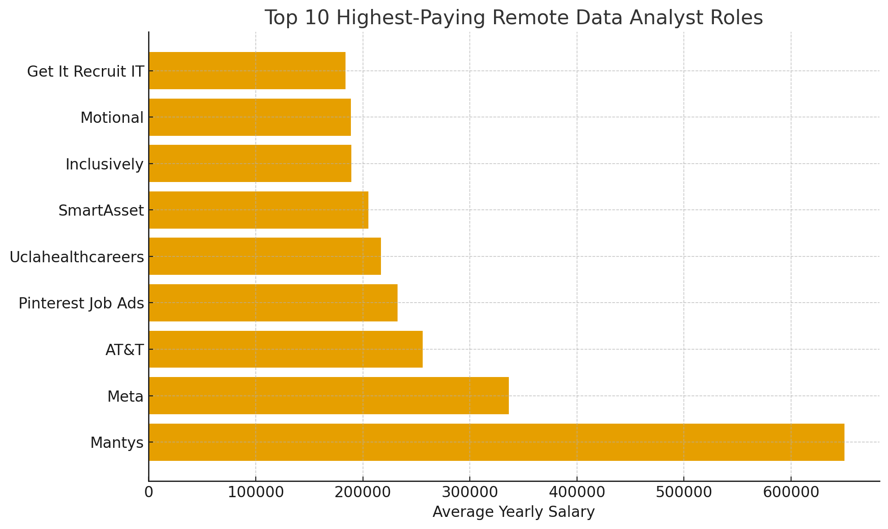

**JUST A PRACTICE**
# Introduction
Dive into the data job market. The project focuses on data analyst roles and explores top-paying jobs, in-demand skills, and where high demand meets high salary in data analystics.

**LINK TO SQL Queries**: [project_sql folder](/project_sql/)

# Background

# Tools I Used

# The Analysis
### 1. Top Paying Data Analyst Jobs
To identify the top 10 highest-paying Data Analyst roles that are avaliable remotely.

Code Block Formatting:

```sql
SELECT
    job_id,
    job_title,
    job_location,
    job_schedule_type,
    salary_year_avg,
    job_posted_date,
    name AS company_name
FROM
    job_postings_fact
LEFT JOIN company_dim ON job_postings_fact.company_id = company_dim.company_id
WHERE
    job_title_short = 'Data Analyst' AND
    job_location = 'Anywhere' AND
    salary_year_avg IS NOT NULL
ORDER BY salary_year_avg DESC
LIMIT 10;
```

code for uploading image: 

*Bar graph visualising the result*

# What I Learned

# Conclusions